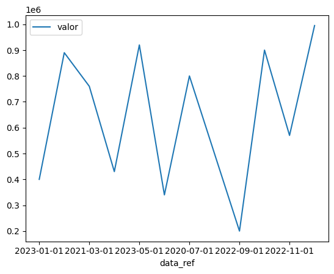
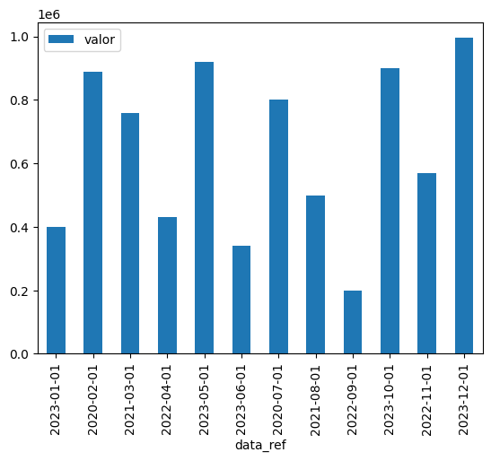

#### Sobre o desafio

Nesse desafio trataremos um dicionário utilizando as bibliotecas Pandas e MatplotLib para obter a média de vendas de uma loja e trazer visualizações mais objetivas utilizando gráficos de barra e linhas.

# Gráfico de linhas mostrando o mês de referência e o valor.

df_faturamento.plot.line(x="data_ref",y="valor")

# Gráfico de barras vertical mostrando o mês de referência e o valor

df_faturamento.plot.bar(x="data_ref",y="valor")

df_faturamento.info()

<class 'pandas.core.frame.DataFrame'>
RangeIndex: 12 entries, 0 to 11
Data columns (total 2 columns):
 #   Column    Non-Null Count  Dtype 
---  ------    --------------  ----- 
 0   data_ref  12 non-null     object
 1   valor     12 non-null     int64 
dtypes: int64(1), object(1)
memory usage: 320.0+ bytes

# Conversão da variável data_ref de volta para uma string,
# o que restaurará no tipo object novamente.

df_faturamento['data_ref'] = df_faturamento['data_ref'].astype(str)

media_vendas

# Arredondando a média através do método round() com 2 casas decimais

media_vendas = round(df_faturamento["valor"].mean(),2)

np.float64(642083.33)

# Média das vendas

df_faturamento["valor"].mean()

np.float64(642083.3333333334)

df_faturamento.info()

<class 'pandas.core.frame.DataFrame'>
RangeIndex: 12 entries, 0 to 11
Data columns (total 2 columns):
 #   Column    Non-Null Count  Dtype         
---  ------    --------------  -----         
 0   data_ref  12 non-null     datetime64[ns]
 1   valor     12 non-null     int64         
dtypes: datetime64[ns](1), int64(1)
memory usage: 320.0 bytes

# Conversão da variável data_ref(object) para datetime

df_faturamento['data_ref'] = pd.to_datetime(df_faturamento['data_ref'])

df_faturamento

data_ref	valor
0	2023-01-01	400000
1	2020-02-01	890000
2	2021-03-01	760000
3	2022-04-01	430000
4	2023-05-01	920000
5	2023-06-01	340000
6	2020-07-01	800000
7	2021-08-01	500000
8	2022-09-01	200000
9	2023-10-01	900000
10	2022-11-01	570000
11	2023-12-01	995000

# Dataframe de faturamento

df_faturamento = pd.DataFrame.from_dict(dict_faturamento)

# Dicionário de faturamento

dict_faturamento = {
    'data_ref': [
        '2023-01-01', 
        '2020-02-01', 
        '2021-03-01', 
        '2022-04-01', 
        '2023-05-01',
        '2023-06-01', 
        '2020-07-01', 
        '2021-08-01', 
        '2022-09-01', 
        '2023-10-01',
        '2022-11-01', 
        '2023-12-01',
        ],
    'valor': [
        400000, 
        890000, 
        760000, 
        430000, 
        920000,
        340000, 
        800000, 
        500000, 
        200000, 
        900000,
        570000, 
        995000,
        ]
}
import matplotlib.pyplot as plt

pd.__version__
import pandas as pd